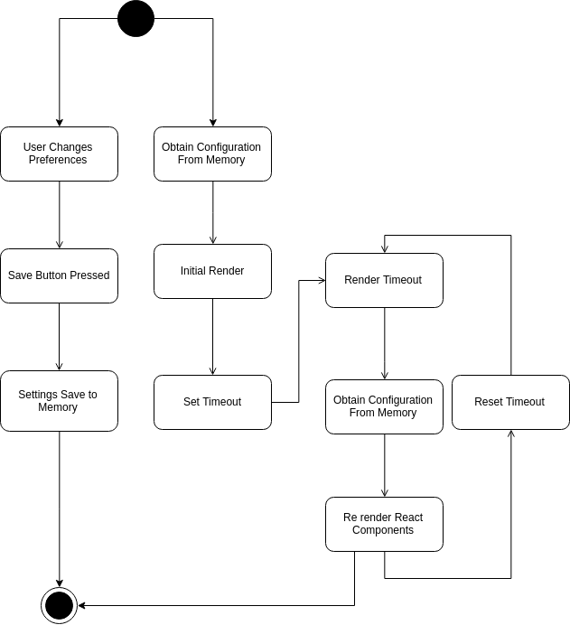
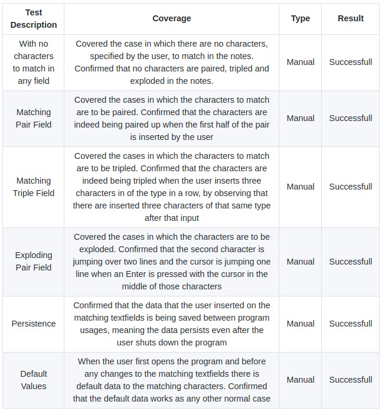
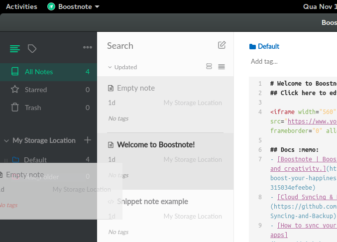
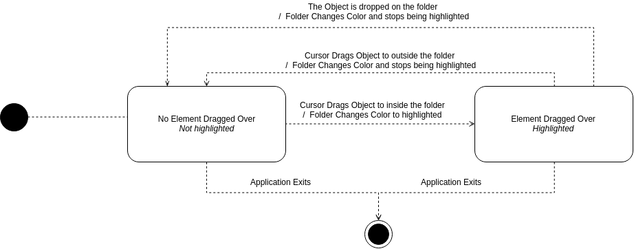

# Issue #2508

## The issue

The first issue we intend to tackle consists in a feature which allows the user to disable quotes/parentheses/brackets automatic matching. This issue is being tracked in GitHub, and it’s the issue #2508.

## Requirements

Boostnote is coded mainly in javascript, so, even though it’s a Desktop application it has a web - like development.

Some users expressed that they do not like this feature in a context other than coding, as such solving this issue will allow the user to disable the automatic matching function when desired.

{height=90px}

{height=100px}

In the pictures above, between both of them, just the first parenthesis were inserted by the user. The other was automatically inserted and the cursor stays inside of them.

It was also requested that the user should be able to choose which characters he desires to have paired/tripled/exploded.

* Paired characters is when a given character is typed, its closing character is added right after.

* Tripled characters is when 3 character of given type are inserted in sequence, this same characters are repeated right after, i.e. ''' becomes ''''''.

* Exploded characters is when a new line is inserted between one of these pairs, the second character moves 2 lines down.

## Source Code Files

To add new options to the preference tab, the file *browser/main/modals/PreferencesModal/UiTab.js* will need to change.

    
The file *browser/main/lib/ConfigManager.js* contains default values for the configuration, therefore some new fields will need to be added.

The following files represent several types of editors, which will suffer changes to accomudate the new configuration options:

* *browser/main/modals/PreferencesModal/SnippetTab.js*
* *browser/main/modals/PreferencesModal/SnippetEditor.js*
* *browser/main/Detail/SnippetNoteDetail.js*
* *browser/components/MarkdownSplitEditor.js*
* *browser/components/MarkdownSplitEditor.js*
* *browser/components/MarkdownSplitEditor.js*

## Relevant System Architecture

Before tackling the issues, a look needs to be taken over the overall architecture of the program. For brevity, the following diagrams have been simplified to show only the relevant architecture.

In the following diagram the main components of the board are represented: 

* Local Storage: Stores permanent files containing the programs information, i.e. configuration.

* Configuration Manager: Retrieves the current configuration from memory and saves any changes made to it.

* Update Server: Checks the remote repository for any updates to the program.

* Markdown Renderer: External library to convert markdown to html.

* CodeMirror: External library that textual input.

{height=300px}

{height=400px}

Following the components, it can be seen a simplified version of the class diagram, in which some of the classes implemented in the project can be seen, including those that need to be modified.

Finally, it is relevant to show how the program loads changes made to the configuration.

{height=400px}
    
## Design of the fix
    
As it is shown in the component diagram, the program uses a JavaScript package called CodeMirror to handle the main textual input. This package can be configured to automatically close brakets, by passing a string containing which characters are to be closed with which characeters. In fact, CodeMirror can have 3 types of auto bracket matching:

* Matching pairs - When a given character is typed, it's closing character is added right after.

* Matching triplets - When 3 character of given type are inserted in sequence, this same characters are repeated right after, i.e. `'''` becomes `''''''`, however the combination of characters must also be present in the matching pairs, this restrain is introduced by the CodeMirror package.

* Exploding pair - When a new line is inserted between one of these pairs, the second character moves 2 lines down.

{width=250px}

To make use of this feature, 3 fields (one for each type) can be added to the preferences, so that the value saved in these can be passed down to the editor along with all other configurations. To change these fields, 3 textboxes can be added to the interface tab in the preferences window.

When the configuration is changed and a new render is needed, the React framework only changes the components that suffered changes in its attributes, therefore the function that verifies such updates must be updated.

Finally, these new fiels must have default values, these can take the strings that are being used to permanently configure o CodeMirror in the current version of the program.

{width=550px}

## Validate the fix

To validate the fix of the issue, the group tested several different characters to be paired, tripled and exploded. It was verified that when the settings changes were saved and those characters inserted they were indeed matched in the intended way. Limit cases were tested, like having no characters at all to be matched and having the same character in all options. The code structure was validated by the tool _esLint_ and passed all tests.

{width=550px}

## Submission of the fix

The fix was submitted via pull request at the 8th of November, no errors or compatibility problems were found but the acceptance is still pending. There was a previous submission of the fix but it was far more incomplete that the submission of our group. The issue was not changed from Delivery #1 to Delivery #2. The issue was not modified by the group, it was strictly followed as it was on the issue list.

# Issue #1885

## The issue

The second issue we intend to solve consists in an improvement which highlights a folder when it’s hovered when moving notes between folders. This issue is being tracked in GitHub, and it’s the issue #1885.

## Requirements

Boostnote is coded mainly in javascript, so,  even though it’s a Desktop application it has a web - like development. 

It’s not quite an issue, more of a request for an improvement to the application. It was requested that when moving notes between folders that the hovered folder was highlighted to help understand the folder that was being selected as a destination for the note being picked.

{height=200px}

{height=200px}

In the top image we have the hovered folder being highlighted. The objective of this issue is to produce the same effect when, while dragging a note, the cursor hovers a folder. As we can see in the bottom image no highlighting is done when hovering a folder while dragging a note.

## Source Code Files

The file *browser/main/SideNav/StorageItem.js* handles the detection of the cursor when a note is dragged over and each of the elements implemented in the previous file have their style in *browser/main/SideNav/StorageItem.styl*

## Relevant System Architecture

Before tackling the issues, a look needs to be taken over the overall architecture of the program. For brevity, the following diagrams have been simplified to show only the relevant architecture.

In the following diagram the main components of the board are represented:

* Local Storage: Stores permanent files containing the programs information, i.e. configuration.

* Configuration Manager: Retrieves the current configuration from memory and saves any changes made to it.

* Update Server: Checks the remote repository for any updates to the program.

* Markdown Renderer: External library to convert markdown to html.

* CodeMirror: External library that textual input.

{height=300px}

{height=400px}

Following the components, it can be seen a simplified version of the class diagram, in which some of the classes implemented in the project can be seen, including those that need to be modified.

For this issue is relevant to show the relevant states of the folders in the side navigation bar.

{width=600px}

## Design of the fix
    
The fix for this problem is rather simple. The functionality of moving notes between folders by dragging them already exists, so the hover of a note over a folder is already handled. The only needed implementation was to change the styling of the destination folder when it was hovered. So the fix will consist in adding a CSS class to the object that represents a folder when a dragged note is hovered over the former, this CSS class will change the style of the folder to match when the same object has the mouse over it.

## Validation of the fix

Because this issue was a graphic interface issue, there were no unit tests that could be run to assure it was fully right. So, many tests were performed by the group that verified many use cases that used this fix. It was evident that the folder was indeed becoming highlighted when notes were dragged over it, and stop being highlighted when the note leaves that area. It also stops being highlighted when the note is dropped, and it was verified that the note actually changed folders. The code structure was validated by the tool _esLint_ and passed all tests.

{width=550px}

{width=550px}

## Submission of the fix

The fix was submitted via pull request at the 30th of November and was accepted and merged to the master branch at the 13th of December. The fix will be released in the release v0.11.12. It hadn't been solved before. The issue was not changed from Delivery #1 to Delivery #2. The issue was not modified by the group, it was strictly followed as it was on the issue list.

# Wrap up 

During this work, the different tasks were evenly distributed among the group elements.